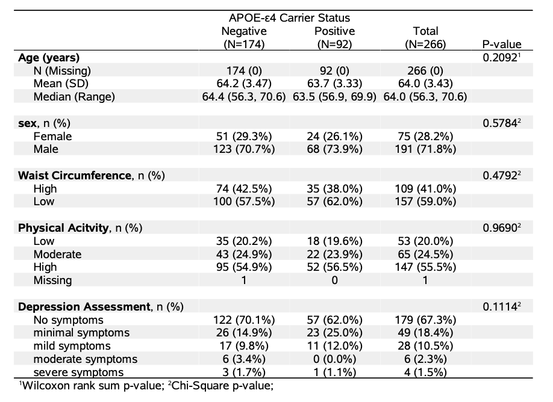
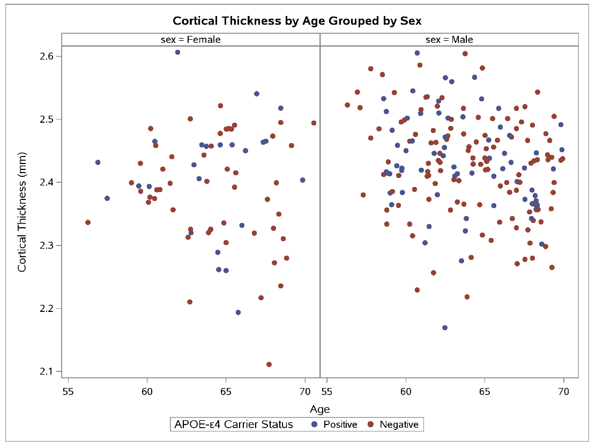

---
title: "Sex and Genetic Risk Factors for Cognitive Impairment in Late
Middle-Aged Adults"
output: 
  html_document
---

#### **Background**

Alzheimer’s disease (AD) is the leading cause of dementia in the U.S., affecting 11% of individuals aged 65 and older, with a higher prevalence in females. The reasons for this sex difference are not fully understood but may involve biological and genetic factors. Advances in AD research have highlighted brain amyloid plaques and neurodegeneration as key pathological markers. This cross-sectional study investigates how sex and APOE-ε4 carrier status—one of the strongest genetic risk factors for AD—relate to AD neuropathology. Cognitive impairment is assessed using two biomarkers: brain amyloid beta (Aβ) burden, measured through PET scan SUVR values, and neurodegeneration, measured by cortical thickness in MRI scans.

**Research Question:**
Are there differences in mean amyloid beta (Aβ) levels based on APOE-ε4 carrier status or sex?

#### **Methods**

Demographic characteristics (e.g., age and sex), as well as physical and mental health variables, were compared across APOE-ε4 carrier status (Table 1.). The Wilcoxon test was used for age, while Pearson's Chi-square test was applied to categorical variables (e.g., physical activity, depression assessment, waist circumference status, and Aβ positivity status). High or low waist circumference was used as a measure for adiposity by sex. Differences in mean Aβ levels between APOE-ε4 carrier statuses and sexes were assessed using the non-parametric two-sample t-test. Aβ positivity was defined as an amyloid beta (Aβ) global standardized uptake value ratio (SUVR) greater than 1.15 units. Associations between APOE-ε4 carrier status and Aβ positivity, as well as between sex and Aβ positivity, were tested using Chi-square tests. To explore differences in cortical thickness across APOE-ε4 carrier statuses and sexes, a two-way ANOVA was conducted. All results were reported at a significance level of p < 0.05. All statistical analyses and figures were generated using SAS.

Associations between the covariates and the two primary outcomes—cortical thickness (a continuous measure of neurodegeneration) and mean Aβ levels—were examined using general linear models. Cortical thickness was modeled using linear regression. The interaction between sex and APOE-ε4 carrier status was evaluated both separately and within the full model to assess potential effect modification. Stepwise regression was employed to identify the most parsimonious set of predictors. For all final models, assumptions of normality of residuals and homoscedasticity were assessed and met.

<figure style="text-align: center;">
    <figcaption style="font-size: 14px; color: #555; margin-top: 5px;">
        Table 1. Comparison of Demographic and Physical Characteristics by APOE-e4 carrier status
    </figcaption>
    
    
</figure>

#### **Results**

The final study population included 266 patients. Of all the participants, 92 participants were classified as APOE-ε4 carriers, presence of an ε4 allele, while 174 participants were not carriers (Table 1). Among females, there were 24 APOE-ε4 carriers (32%) and 51 non-carriers (68%). Among males, there were 68 APOE-ε4 carriers (35.6%) and 123 non-carriers (64%). 232 patients were non-Aβ Positivity status while 34 patients had Aβ Positivity status.
	Aβ levels among males and APOE-ε4 carriers were not normally distributed (p<0.0001 and p<0.001, respectively), so Wilcoxon tests were used. Results showed significant differences in Aβ levels by both sex and APOE-ε4 carrier status (p<0.0001 and p<0.001). There was a significant association between APOE-ε4 status and Aβ positivity ( Chi-square test p=0.00015). Fisher’s test showed significant association between sex and Aβ positivity (p=0.024.	
	
Cortical thickness was normally distributed by APOE-ε4 carrier status (Positive: p = 0.20; Negative: p = 0.08) and sex (Female: p = 0.15; Male: p = 0.42). Equal variances were met across APOE-ε4 groups (Brown-Forsythe test p = 0.41) and sex (p = 0.20). A two-way ANOVA showed a significant overall model (p = 0.0033), with sex significantly associated with cortical thickness (p = 0.0014), but not APOE-ε4 status (p = 0.25). A scatter plot (Figure 1) shows no visual distinction in cortical thickness by APOE-ε4 status.	

<figure style="text-align: center;">
    <figcaption style="font-size: 14px; color: #555; margin-top: 5px;">
        Figure 1: Cortical Thickness by Age differences across Male and Female and APOE carrier status
    </figcaption>
    
    
</figure>

The GLM with only the interaction term of sex and APOE-ε4 carrier status showed no significant interaction for cortical thickness (F=0.76, p=0.38) or mean Aβ levels (p=0.73). However, the main effect of sex was significant for cortical thickness (p=0.0076), while APOE-ε4 carrier status was not (p=0.18). Both main effects—sex (p < 0.001) and APOE-ε4 carrier status (p < 0.001)—were significant for mean Aβ levels. This is illustrated in Figure 2, where mean Aβ SUVR is lower in females and in those with negative APOE status. After adjusting for age, depression symptoms, low physical activity, and high waist circumference, sex remained significantly associated with cortical thickness (p = 0.0371), but APOE-ε4 carrier status and the interaction term were not. In the adjusted model for Aβ levels, both sex (p < 0.001) and APOE-ε4 status (p < 0.0001) remained significant.

<figure style="text-align: center;">
    <figcaption style="font-size: 14px; color: #555; margin-top: 5px;">
        Figure 2: Mean Amyloid beta global standardized uptake value ratio (SUVR) by sex and APOE-ε4 carrier status. 
    </figcaption>
    
</figure>

The final model for cortical thickness, selected through stepwise model selection, included the intercept, sex, and age as significant predictors. The estimated mean cortical thickness for females at age 55 was 2.67 (p<0.001). Males were associated with 0.035 mm (CI: 0.0133, 0.056; p = 0.0017) higher cortical thickness than females, adjusting for age. For each additional year of age, cortical thickness was estimated to decrease by 0.00438 mm (CI: -0.0072, -.0015; p = 0.0028), holding sex fixed. The model assumption of normally distributed residuals was met (p = 0.073). Homoscedasticity also holds with no visible pattens in residual plots. 
The final model for mean Aβ levels, selected through stepwise model selection did not meet the normality assumption of residuals was not met (p < 0.001). Despite the use of stepwise selection on logistic regression of Aβ positivity, the resulting logistic regression model did not meet the Hosmer-Lemeshow test for good fit, prompting the use of the full model instead.

The final logistic regression model had an of ROC of 0.7513, and good fit (p= 0.21), indicating fair model fit. None of the predictors in the model were statistically significant, as their 95% Wald confidence intervals included 1. Point odds ratio estimates suggested potentially lower odds of Aβ positivity in participants with mild or severe depressive symptoms compared to those with no symptoms, and higher odds among those with moderate depressive symptoms, low or moderate physical activity, and higher waist circumference compared to low waist circumference and high psychical activity. Age was associated with slightly lower odds of Aβ positivity. 

#### **Discussion**

This analysis found significant sex differences in Aβ levels, consistent with prior studies, and observed differences by APOE-ε4 carrier status, suggesting a genetic predisposition to amyloid accumulation. Although APOE-ε4 status wasn't included in the final cortical thickness model, the results align with literature showing age as a primary factor in Alzheimer's pathology, with demographic and lifestyle variables potentially reducing genetic impacts. The cortical thickness model showed greater thickness in males than females, highlighting the complex role sex plays in neurodegeneration, with females potentially more susceptible. However, due to wide confidence intervals and non-significant predictors in the logistic regression, these findings should be interpreted cautiously. Future research should investigate longitudinal relationships between APOE-ε4, sex, and Aβ accumulation, considering additional covariates like hormonal status, comorbidities, and lifestyle factors, as well as underlying biological mechanisms.
