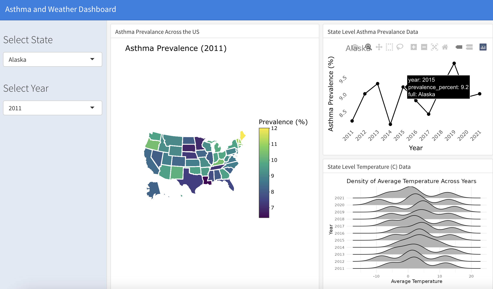

<style>
body {
    font-family: 'Georgia', serif;
}

h1, h2, h3 {
    font-family: 'Arial', sans-serif;
}
</style>

## Project Overview

In my first semester of the Master's program, I collaborated with a team to explore the health impacts of global climate change, focusing on asthma prevalence. We examined how rising temperatures could increase asthma risks for vulnerable populations.

### My Role

- Responsible for [**data visualization**](https://zzihanlin.github.io/p8105_final/mapping.html) and creating a **customizable Shiny dashboard**.
- Enabled users to explore asthma trends across states and incorporate temperature trends over time.
- Created a user-friendly interface with no coding knowledge required.

### Key Features

- **Shiny App:** Visualizes asthma trends across states with temperature data.
- **Comparison Tool:** Compare asthma and temperature trends within and between states over multiple years.
- **Enhancement:** Goes beyond the CDC website by adding specific state-level comparisons.

Check out the project here: [Shiny App](https://klopez67.shinyapps.io/final_draft/)  

```{=html}
<a href="https://klopez67.shinyapps.io/final_draft/">
    
</a>
```


Learn more about our methodology: [Regression Analysis](https://zzihanlin.github.io/p8105_final/index.html)

### Software Used:
- GitHub  
- ShinyApps.io (for dashboard deployment)


