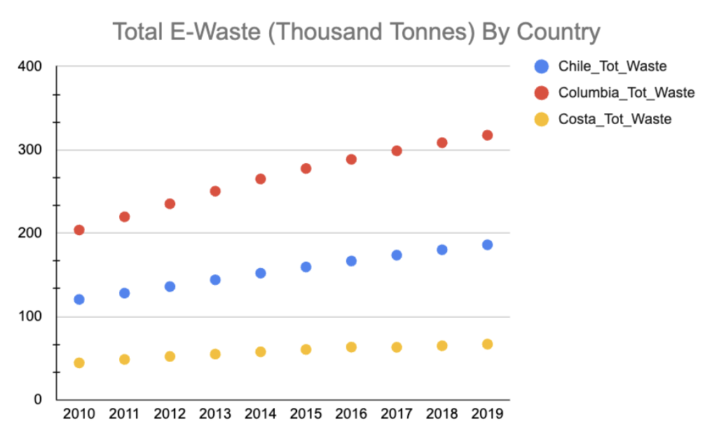
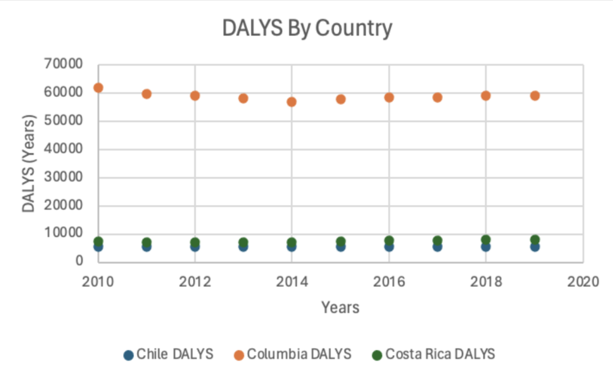
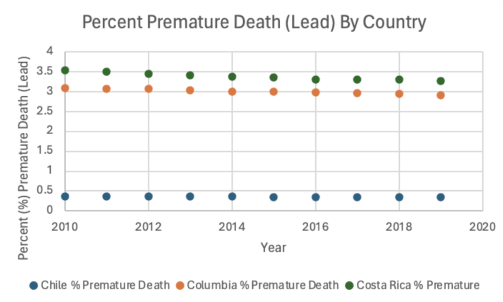

While taking the course **Environmental Epidemiology** at Lehigh University, I chose to investigate Electronic waste and its effects on Health outcomes in Latin America for my final project. We were tasked with sourcing public data, propose a statistical plan, and conduct an analysis to answer our research question.

#### **Background**
E-waste is increasing globally at a rate of 3.5% annually and improper disposal enable metals to leach into groundwater, soil, and can emit semi-volatile compounds in the air. The top three E-waste Exposure Pathways include:

- Dermal Exposure: handling lead contaminated E-waste
- Inhalation Exposure: burning and processing of e-waste can be inhaled through fumes
- Ingestion exposure: E-waste lead improperly disposed may contaminate groundwater

> In Latin America, **97% of e-waste is improperly managed**.

###### **Research Question:** 

What are the health impacts of e-waste on premature deaths and DALYs from 2010-2019 in Latin American Countries: Costa Rica, Colombia, and Chile? How has it changed or fluctuated over time?

#### **Methods**
**Data source:** Organization For Economic Co-operation and Development

**Data Analysis:**

Graphically demonstrate the general trends of the data and run simple linear regressions
Application of the generalized additive method analysis using total E-waste to investigate the relationship between DALYs due to lead and percent total premature deaths due to lead by country
Application of the generalized additive method analysis using total E-waste to predict DALYS related to lead

#### **Results**

- E-waste Trends: All three countries showed significant increases in e-waste from 2010 to 2019, with Colombia having the highest increase (12.67 thousand tonnes/year, p = 3.76e-09).

- Premature Deaths due to Lead: CostaRica and Colombia had significant decreases in premature deaths due to lead (−0.029 and −0.019 per year), while Chile showed a smaller decrease (−0.0026 per year).

- DALYs and E-waste: CostaRica showed a significant positive correlation between e-waste and DALYs due to lead (β = 34.25, p = 0.0072), while Chile and Colombia had insignificant results.

#### **Discussion**

The application of the generalized additive mixed-effect model (GAM) allowed for a more accurate understanding of the relationship between e-waste and health outcomes in Latin America, providing significant insights despite the model’s limitations due to the small sample size.

Future studies should focus on expanding the dataset with more years of e-waste data, as well as incorporating longitudinal exposure assessment and biomonitoring data from individuals in direct contact with e-waste, to improve the model’s predictive power and inform more effective health interventions.