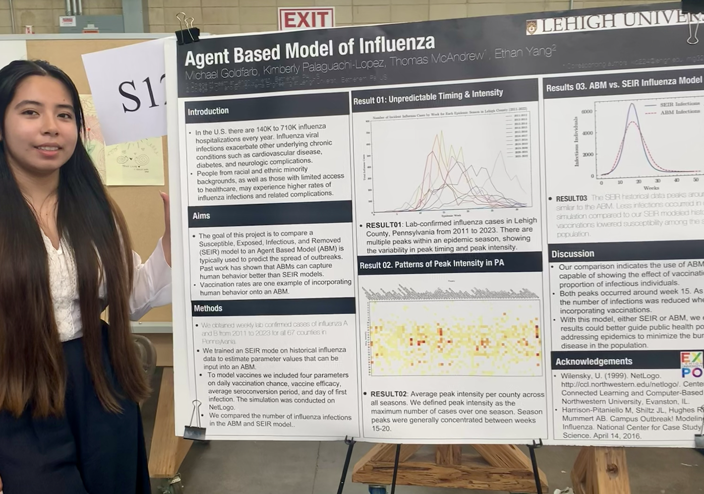

<style>
body {
    font-family: 'Georgia', serif;
}

h1, h2, h3 {
    font-family: 'Georgia', serif;
}
</style>
```{=html}
<style>

.timeline {
  position: relative;
  max-width: 800px;
  margin: 0 auto;
  padding: 20px 0;
}

.timeline-item {
  margin: 20px 0;
  padding-left: 40px;
  border-left: 2px solid #2C3E50; 
  position: relative;
}


.timeline-item:before {
  content: '';
  width: 16px;
  height: 16px;
  border-radius: 50%;
  background: #2C3E50; 
  border: 2px solid #FFFFFF;
  position: absolute;
  left: -10px;
  top: 0;
}


.timeline-content {
  background: #F9F9F9;  
  border-radius: 5px;
  padding: 10px;
  box-shadow: 0 2px 5px rgba(0, 0, 0, 0.1);
}

.timeline-content h4 {
  margin: 0;
  font-size: 1.2em;
  color: #2C3E50;
  font-weight: bold;
}

.timeline-content p {
  margin: 5px 0;
  color: #555;
}

.timeline-item:hover .timeline-content {
  background: #EAEAEA; 
}


.timeline-item:nth-child(odd) .timeline-content {
  background: #F9F9F9;  /* Grey for odd items */
}

.timeline-item:nth-child(even) .timeline-content {
  background: #F1F1F1;  /* Slightly lighter grey for even items */
}

</style>

<h2 style="text-align: center; color: #2C3E50; margin-bottom: 20px;">My Professional Journey</h2>

<div class="timeline">
  <!-- Timeline Item - Breakthrough T1D Internship -->
  <div class="timeline-item">
    <div class="timeline-content">
      <h4>Breakthrough T1D Internship</h4>
      <p><strong>Year:</strong> 2024</p>
      <p><strong>Contributions:</strong> 
      During my 12-week internship, I conducted a landscape analysis of cardiovascular drug treatments for Type 1 Diabetes (T1D), focusing on Phase I and II drug therapies. I examined the pathophysiology of cardiovascular disease in T1D and identified conditions that exacerbate cardiovascular outcomes. A key highlight was delivering a 30-minute presentation to senior scientists, strengthening my ability to communicate complex data. I actively participated in high-level meetings, deepening my understanding of epidemiological studies and clinical trial design. This experience connected my academic knowledge to real-world drug development and clinical trial processes, advancing my understanding of clinical research and FDA regulatory pathways. </p>
      <figure style="text-align: center;">
      
      <figcaption style="font-size: 14px; color: #555; margin-top: 5px;">
        
      </figcaption>
    </figure>
      
    </div>
  </div>

  
  <div class="timeline-item">
    <div class="timeline-content">
      <h4>Research Assistant</h4>
      <p><strong>Year:</strong> 2024</p>
      <p>I supported statistical analyses for a project on greenspace and health, working with a pre- and post-survey dataset to assess changes in health outcomes. My goal was to ensure data accuracy, apply appropriate statistical methods, and contribute to a manuscript for a major public health conference. I conducted data wrangling, merging, and cleaning to enhance data quality. I applied univariate and bivariate analyses, as well as longitudinal modeling, to identify trends. Additionally, I collaborated to interpret findings and co-authored a manuscript.</p>
      <p><strong>Contributions:</strong> Strengthened the study’s statistical rigor, and our manuscript was successfully accepted for APHA 2024, showcasing the impact of my work in public health research.</p>
      <p>
        <a href="https://apha.confex.com/apha/2024/meetingapi.cgi/Session/71280?filename=2024_Session71280.html&template=Word#:~:text=Are%20greener%20window,Meeting%20and%20Expo" target="_blank">
          Click here to view the abstract.
        </a>
      </p>
    </div>
  </div>


<div class="timeline-item">
  <div class="timeline-content">
    <h4>STEM-SI Lehigh University (Influenza Agent Based Modeling)</h4>
    <p><strong>Year:</strong> 2023</p>
    <p>Using a SEIR model, I simulated influenza spread across Pennsylvania's 67 counties, leveraging weekly MMWR data from 2011 to 2023 provided by the CDC. The extensive dataset, covering three influenza strains, posed challenges in handling and processing. To address this, I initially worked with a smaller data sample to test and refine my Python and NetLogo code. This iterative approach ensured accuracy and efficiency before scaling up to the full dataset, ultimately yielding valuable insights into influenza dynamics over a 12-year period.</p>
    <p><strong>Contributions:</strong> Modeled influenza spread using a SEIR framework, overcame big data challenges by iteratively refining code with smaller samples, and scaled the model to the full 13-year dataset, providing actionable insights into long-term influenza trends.</p>
    <figure style="text-align: center;">
      
      <figcaption style="font-size: 14px; color: #555; margin-top: 5px;">
        Presenting research at the Lehigh University STEM-SI Research Symposium 2023.
      </figcaption>
    </figure>
  </div>
</div>


  
<div class="timeline-item">
  <div class="timeline-content">
    <h4>Village Care Max</h4>
    <p><strong>Year:</strong> 2023</p>
    <p><strong>Role:</strong> Data Management Intern</p>
    <p>At Village Care Max, I managed vaccine data for older adults, ensuring <strong>HIPAA compliance</strong> was upheld. While my main task involved precise data handling, I had the opportunity to <em>engage with healthcare professionals and data scientists</em>, gaining insights into the pivotal role of data in shaping population health strategies. This experience not only refined my technical abilities but also expanded my vision of how data science contributes to healthcare advancements.</p>
    <p><strong>Contributions:</strong> Efficiently managed and safeguarded patient data, adhered to privacy regulations, and explored the expansive role of data in population health through proactive networking.</p>
  </div>
</div>


  
  <div class="timeline-item">
    <div class="timeline-content">
      <h4>Pathways to Trust</h4>
      <p><strong>Year:</strong> 2022</p>
      <p><strong>Contributions:</strong> Strengthening Pathways to Trust's outreach efforts by identifying and researching potential grant opportunities and fostering key partnerships. This work facilitated the organization’s ability to secure funding, expand its network, and enhance its capacity to deliver community-based health initiatives.</p>
    </div>
  </div>
</div>

```


