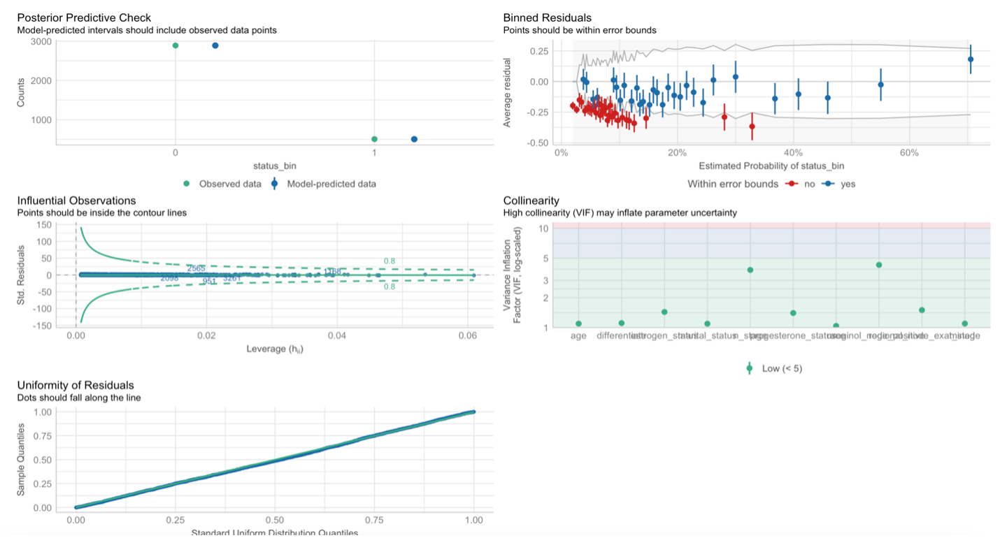
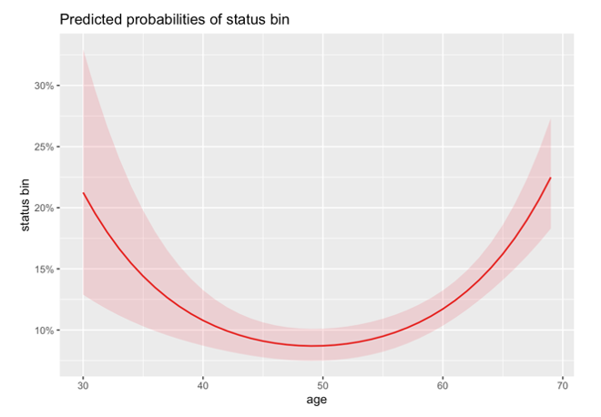
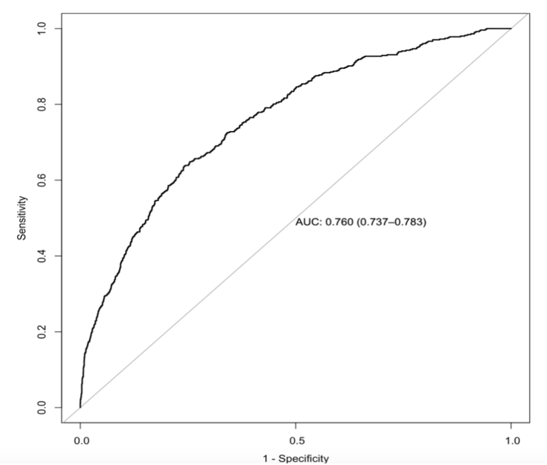

---
title: "Breast Cancer Risk of Death Prediction and Survival Models"
output: 
  html_document
---

While taking the course **Biostatistics** at Columbia University, our final project objective was to analyse and model Breast Cancer data from a Prospective Cohort study and assess model accuracy across different race and ethnicity. My team and I delegated areas of focous to identify which model best predicts death among Breast Cancer patients. I focused on applying logistic regression to predict the outcome of death. 

#### **Background**

Breast cancer survival rates have significantly improved over the years, highlighting the importance of identifying factors that contribute to improved outcomes to advance the existing body of literature. Key biological factors influencing breast cancer survival include the differentiation status at diagnosis, as well as tumor (T), node (N), presence of distant metastasis (M) stages, and histological grade. Researchers have also found age and marital status significantly influencing breast cancer survival among cohorts.

**Project Goals:** 

1.) Use covariates to predict the risk of death and to identify significant factors influencing this risk. 

2.) Examine interaction effects among covariates and to evaluate the model’s performance through cross-validation, with particular attention to potential differences in predictive compatibility across racial groups.

#### **Methods**
**Data source:** 

The dataset used for this study was collected from a **prospective cohort of breast cancer patients**. There were 4,024 patients aged 30 years to 69. Baseline data included 14 variables, with patient status (alive or dead) recorded at the study's conclusion, alongside survival months tracked for up to 107 months. The dataset included three demographic variables: age, race, and marital status (Figure 1). The dataset includes numerous clinical variables relevant to breast cancer staging.

<figure style="text-align: center;">
    <figcaption style="font-size: 14px; color: #555; margin-top: 5px;">
        Figure 1: Demographic Summary Table of Breast Cancer Cohort.
    </figcaption>
    
    
</figure>

**Data Analysis:**

We utilized two validated methods for variable selection for logistic regression: **Stepwise variable selection** and **LASSO regression**. The stepwise regression indicated the “best” model included a subset of age, race, marital status, differentiate, estrogen status, progesterone status, regional node examined, and regional node positive. Each were compared on goodness of fit by applying the **ANOVA partial F-test** on variables present in the stepwise regression and not in the cross validated LASSO model as well as assessing interaction terms between regional node examined and positive. The ANOVA results indicated the stepwise regression and model without the interaction term was the superior model. 

#### **Results**

<figure style="text-align: center;">
    <figcaption style="font-size: 14px; color: #555; margin-top: 5px;">
        Figure 2: Logistic Regression Model Diagnostics.
    </figcaption>
    
    
</figure>

The logistic regression model assumes linearity of the logit outcome, must contain no influential outliers, independence of error terms, and there must be no multicollinearity among variables. The logistic regression model met all diagnostics except for the linearity assumption between age and the logit outcome (Figures. 3). All variables had low VIF scores (<5), indicating no significant collinearity concerns, and residuals were uniformly distributed. Cook's distance revealed no influential outliers. 

<figure style="text-align: center;">
    <figcaption style="font-size: 14px; color: #555; margin-top: 5px;">
        Figure 3: Assessing Linearity of Age and Logit outcome.
    </figcaption>
    
</figure>

<figure style="text-align: center;">
    <figcaption style="font-size: 14px; color: #555; margin-top: 5px;">
        Figure 4: Polynomial variable of Age and Logit outcome.
    </figcaption>
    
</figure>

A second-degree polynomial term for age significantly improved the model fit compared to models without it, as confirmed by ANOVA nested models’ test. Between ages 30 and 50, the probability of death decreased with age, but after 50, it increased. At age 50, the probability of death was 24.1% (95% CI: 16.7%–33.6). Younger patients (age 30) had 2.74 times greater odds of death compared to 50-year-olds while 50-year-olds had 0.29 times lower odds of death compared to 70-year-olds. 

<figure style="text-align: center;">
    <figcaption style="font-size: 14px; color: #555; margin-top: 5px;">
        Figure 5: Logistic Model Performance.
    </figcaption>
    
</figure>

The logistic regression model had an AIC of 2483 and an AUC curve of 0.76 (Figure. 5). After computing the Confusion matrix table, we found this model to be a 86.13% accuracy( 95% CI: 0.8492- 0.8727) with a high sensitivity of 86.76%, Specificity of 63.39%, and positive predictive value of 98.48% overall, indicating less accuracy in identifying negative cases.

#### **Discussion**

After conducting the **likelihood ratio test for logistic regression**, the Analysis of Deviance (Type II test) showed regional node positive was the top contributor for this logistic model followed by age and differentiated status. These results also suggest race and marital status were the least important predictors. The polynomial results of age were averaged over the levels of covariates from the logistic model. These results were also adjusted for multiple comparisons using the **Tukey method thus reducing our Type I Error**. The limitation of lower accuracy in identifying negative cases may be due to the smaller proportion of negative cases in the dataset. To address this more data could be included to improve the model testing efforts with cross validation. 

Overall, our team decided to move on with the cox regression as it does not assume linearity between covariates and logit outcome thus making it the superior model to use. Binomial distributions do not account for this wearout of age we observed in the data on the outcome thus the cox regression is the superior model to use.
